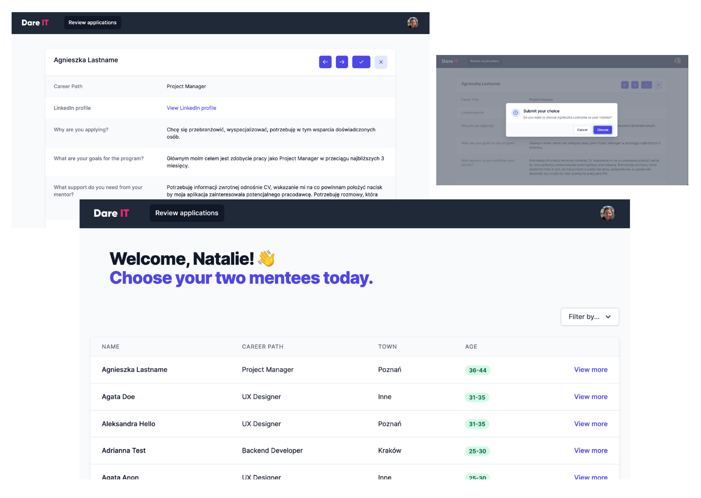

# MenteeMatch

MenteeMatch is a web app that allows mentors to browse mentee profiles and choose the mentees they would like to mentor. It was built for the [Dare IT Mentoring Program](https://mentoring.dareit.io/).

# Screenshots

<p>

</p>

# Getting started

Except for the regular suspects

- git
- Node, npm & nodemon
- PostgreSQL (see step 3 below)

You need these things to work on the Double Mattress app.
Once you have them installed, follow the steps below:

1. Clone this repo & enter:

```
git clone https://github.com/pillllo/mentee-match
cd mentee-match
```

2. Install dependencies in the root, client and server folders:

```
npm install

cd client
npm install

cd server
npm install
```

3. [Install PostgreSQL](https://www.postgresql.org/download/) and [start the PostgreSQL server](https://tableplus.com/blog/2018/10/how-to-start-stop-restart-postgresql-server.html)

4. Start the client development server:

```
cd client
npm start
```

5. Start the server development server:

```
cd server
nodemon start
```

# Built with

- [React](https://reactjs.org/)
- [Tailwind CSS](https://tailwindcss.com/)
- [Tailwind UI](https://tailwindui.com/)
- [Node.js](https://nodejs.org/en/)
- [Express.js](https://expressjs.com/)
- [PostgreSQL](https://www.postgresql.org/)
- [Sequelize](https://sequelize.org/master/index.html)
- Love, lots of love ♥

# Author

Natalie Pilling - [GitHub](https://github.com/pillllo) - [LinkedIn](https://www.linkedin.com/in/natalie-pilling/)

# License

This project is licensed under the MIT License.
